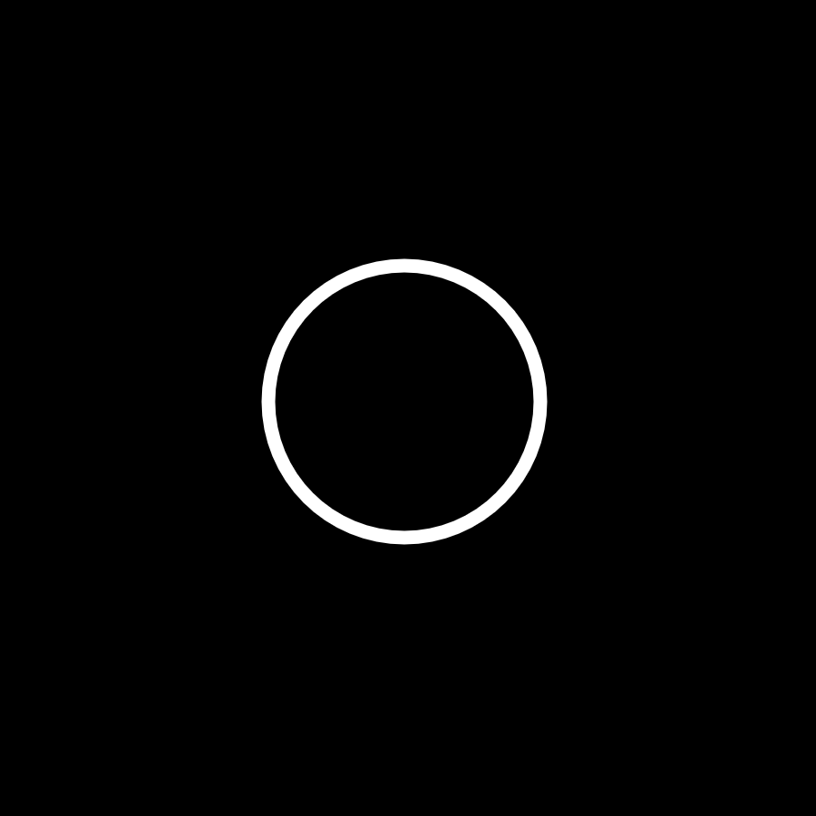

# mu-vis

Music visualization. Made with: Typescript, React.

Check latest build version [here](https://alexmubarakshin.github.io/mu-vis/).

<p align="center">
  
</p>


## Usage
```
$ git clone https://github.com/AlexMubarakshin/mu-vis.git
$ cd ./mu-vis
$ npm i
$ npm start

# Visit localhost:3000
```